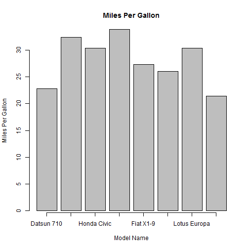

Mtcars
========================================================
author: Anshul 
date: May 20, 2015

Objective
========================================================

The objective of this project is to create a simple Shiny application

- Application Design
- Code
- Summary

Application Design
========================================================
The Application utilizes the MT Cars data set. It displays the data both numerically and on a Plot.

Description

The data was extracted from the 1974 Motor Trend US magazine, and comprises fuel consumption and 10 aspects of automobile design and performance for 32 automobiles (1973-74 models).

A data frame with 32 observations on 11 variables.


You can acess the application at:
https://akaushik3.shinyapps.io/DevelopingDataProducts

The applicataion allows you to choose Cylinders and Transmission to see the results.


Code
========================================================


```
   Min. 1st Qu.  Median    Mean 3rd Qu.    Max. 
  21.40   25.20   28.85   28.08   30.90   33.90 
```

```
[1] 4.48386
```

 

Summary
==================================================

The Shiny application displays the data for 11 different variables for each of the cars based on which Cylinder and Transmission you pick. It will also display in plot on the second Tab.

This is trully a very simple to use applciation to obtain all the data you need to see for each of the cars. It really could not get any easier. 
